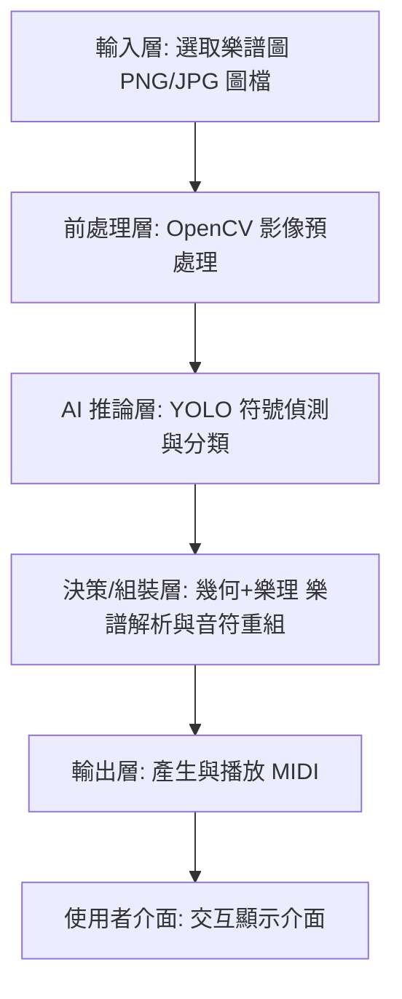

## 1. 專題故事與應用情境

**解決的問題：**
樂器學習者拿到一張紙本或圖片樂譜時，常常看不懂音高與節奏，只能靠老師逐句帶。市面上雖有電子樂譜 App，但多半需要先有數位檔，無法直接把「一張樂譜照片」變成可聆聽的聲音。本專題要解決的就是：把一張樂譜，直接在手機上辨識成可播放的旋律，讓使用者不必懂樂理也能聽到譜上的曲子。

**應用場景：**
使用者用手機選取一張樂譜圖片，系統在手機本機完成辨識並播放，不需連網、不需後端伺服器。

**使用者：**
主要是學習樂器的學生，對學生而言，他們可能看不懂五線譜；對老師而言，可快速把學生帶來的曲譜轉成聲音示範。

**完成後的價值：**
* 學習者能「聽到」看不懂的譜，降低入門門檻
* 不需網路、不需上傳，完全在手機端離線運作，保護隱私也不受網路限制
* 把抽象的紙本樂譜轉成即時可聽的旋律，作為自學或教學輔助工具

---

## 2. 系統需求與目標規格

**輸入來源：**
單張樂譜的影像檔(使用者從手機相簿選取的 PNG/JPG 圖片)。樂譜為單聲部、高音譜號。

**輸出結果：**
* 在螢幕上顯示辨識摘要(辨識到的音符數、事件數、是否成功產生 MIDI)
* 產生一個 MIDI 檔(.mid)，並可在 App 內以不同音色播放出旋律

**即時性需求：**
本系統屬於單張靜態圖片的批次辨識，不是連續影像串流，因此不要求即時 FPS。目標是使用者選圖後，在可接受的等待時間內(數秒等級，首次因載入模型較久)完成辨識並可播放。重點是「辨識正確性與可離線運作」，而非每秒影格數。

**硬體限制：**
* 平台：Android 手機(最低 Android 7.0 / API 24)
* 處理器：手機 CPU(YOLO 推論用CPU 執行，無需 GPU/NPU)
* 通訊：無需網路，全部在裝置本機運算
* 記憶體：需容納約 100 MB 的 YOLO 模型，於一般中階手機可運行

**成功條件：**
系統能在手機本機：讀入一張樂譜圖 → 辨識出音符的音高與時值 → 產生 MIDI 檔 → 以選擇的樂器播放出旋律。能完整走完「選圖→辨識→出聲」流程即視為達成基本目標。

---

## 3. 實作技術與工具

**硬體平台：**
* Android 手機：最終部署與執行平台，所有辨識與播放都在手機本機完成。選擇手機是因為現代社會幾乎人手一機，並且手機可以儲存大量的樂譜。
* PC(開發/驗證環境)：Windows + Anaconda + Cursor，用於訓練模型、轉檔、以及在上手機前驗證辨識邏輯正確性。

**程式語言：**
* Kotlin：Android App 主體(UI、選圖、模型推論呼叫、MIDI 播放)。它是 Android 官方主推語言。
* Python 3.10：辨識核心邏輯(影像處理與樂理組裝)，透過 Chaquopy 嵌入 Android。選 Python 是因為辨識管線大量使用 OpenCV 與陣列運算，Python 生態最成熟，且能直接沿用 PC 上開發驗證好的同一套程式碼。

**核心函式庫與技術：**
* Chaquopy 17：在 Android 上執行 Python 的橋接工具。為什麼選：讓 PC 上已驗證的 Python 辨識邏輯能原封不動搬上手機，不必用 Kotlin 重寫整套影像處理。負責：在 App 內啟動 Python、讓 Kotlin 與 Python 互相呼叫。
* YOLOv8：(22 類自訓模型，以 ONNX 格式部署)+ onnxruntime-android 1.17：物件偵測模型，偵測樂譜上的符號零件(實心/二分/全音符符頭、各類休止符、連桿 beam、附點、譜號、調號、臨時記號等)。為什麼選 YOLO：樂譜符號是「視覺物件」，YOLO 對小物件偵測快又準，遠優於傳統影像比對。為什麼用 ONNX + onnxruntime：原始 PyTorch 模型無法在手機跑(需 CUDA)，轉成 ONNX 後可用 onnxruntime 在手機 CPU 推論。負責：辨識的第一階段——把符號零件框出來。
* OpenCV(opencv-python 4.5)：傳統電腦視覺函式庫。為什麼選：音高需要「精確幾何位置」(符頭落在第幾線/間)，這是傳統影像處理最擅長、且比學習模型更可靠的工作。負責：偵測五線譜譜線、計算符頭相對位置以推算音高、辨識符桿以判斷時值、去除 YOLO 的重複偵測框。
* NumPy：數值運算函式庫。負責：YOLO 輸出的張量解碼、NMS(非極大值抑制)、各種座標與幾何計算。
* 音高與時值的樂理組裝邏輯：把 YOLO 偵測到的零件 + OpenCV 算出的幾何，組合成「音高 + 時值」的音符序列，並套用調號、臨時記號等樂理規則。負責：辨識的第二階段——把零件組裝成有意義的音符。
* 自寫純 Python MIDI 寫檔模組：把辨識出的音符序列輸出成標準 MIDI 檔。為什麼自寫：常見的 midiutil 函式庫無法在 Chaquopy 環境安裝，因此自行實作 MIDI 檔格式輸出。負責：將音符序列轉成可播放的 .mid。
* Android MediaPlayer：播放產生的 MIDI 檔。為什麼選：Android 內建、最輕量，直接以系統 General MIDI 音源播放。 

整體技術分工一句話：YOLO 負責「看出有哪些符號」，OpenCV + 幾何負責「算出音高與時值」，兩者組成音符後輸出 MIDI播放——全程在手機本機完成，無需網路與後端。

---

## 4. 系統架構圖

 
## 5. 演算法與程式流程

系統流程分成三大階段：偵測 → 組裝 → 輸出。

* **Step 1 前處理：** 讀入樂譜圖，轉灰階、二值化，縮放到 1024px。
* **Step 2 YOLO 偵測：** 用 YOLO 把譜上的符號框出來(符頭、休止符、beam、附點、譜號、調號等 22 類)。
* **Step 3 譜線偵測：** 用 OpenCV 找出五線譜的譜線，把每個音符歸到所屬行。
* **Step 4 組裝音符：** 對每個符頭——
  * 看它在第幾線/間 → 算出音高
  * 看接幾條 beam/flag → 算出時值
  * 右邊有沒有附點框 → 判附點
* **Step 5 樂理修正：** 套用調號、臨時記號修正音高，合併連結線。
* **Step 6 輸出：** 把音符依順序組成 MIDI 檔，用直笛音色播放。

---

## 6. 資料集設計與測試方法

本專題主要使用一個AI模型，YOLOv8符號偵測器，使用的是DeepScores v2公開資料集，從中刪除打擊譜、合奏譜、和弦樂譜，篩選出可用的樂譜為19394張，並且從中提取需要的音符種類：

| 類別 ID | 類別名稱 | 數量 |
| :--- | :--- | :--- |
| 0 | noteheadBlack | 142706 |
| 1 | noteheadHalf | 11325 |
| 2 | noteheadWhole | 4005 |
| 3 | rest8th | 8691 |
| 4 | rest16th | 5145 |
| 5 | restQuarter | 11010 |
| 6 | restHalf | 5181 |
| 7 | restWhole | 75860 |
| 8 | flag8thUp | 4521 |
| 9 | flag8thDown | 3891 |
| 10 | flag16thUp | 909 |
| 11 | flag16thDown | 558 |
| 12 | augmentationDot | 10848 |
| 13 | clefG | 79797 |
| 14 | accidentalSharp | 4489 |
| 15 | accidentalFlat | 5451 |
| 16 | accidentalNatural | 4369 |
| 17 | keySharp | 27939 |
| 18 | keyFlat | 39592 |
| 19 | tie | 3759 |
| 20 | slur | 1608 |
| 21 | beam | 7428 |

**總數：約 458,981 個**

### 資料切分

| 集合 | 數量 | 比例 |
| :--- | :--- | :--- |
| 訓練集 | 12000張 | 80% |
| 測試集 | 3000張 | 20% |
| 總計 | 15000張 | 100% |

**訓練資料來源：** DeepScores V2 為以 LilyPond 樂譜排版引擎合成生成的數位樂譜影像，無實際「拍攝條件」。影像特性如下：
* 影像類型：印刷風格樂譜影像
* 解析度：多種解析度（譜線間距變化大）
* 風格：黑白印刷、清晰可辨識
* 排版：標準五線譜版面

### 測試方法
**驗證集自動評估**
訓練過程中使用 3,000 張驗證集（與訓練的 12,000 張完全不重複）進行每個 epoch 的指標驗證。最終訓練結果如下：

| 指標 | 本專題 |
| :--- | :--- |
| 整體 mAP50 | 0.971 |
| 整體 mAP50-95 | 0.933 |

**各類別 mAP50：**

| 類別名稱 | mAP50 |
| :--- | :--- |
| noteheadBlack | 0.995 |
| noteheadHalf | 0.995 |
| noteheadWhole | 0.995 |
| rest8th | 0.995 |
| rest16th | 0.995 |
| restQuarter | 0.995 |
| restHalf | 0.994 |
| restWhole | 0.982 |
| flag8thUp | 0.995 |
| flag8thDown | 0.995 |
| flag16thUp | 0.993 |
| flag16thDown | 0.995 |
| augmentationDot | 0.587 |
| clefG | 0.995 |
| accidentalSharp | 0.995 |
| accidentalFlat | 0.994 |
| accidentalNatural | 0.995 |
| keySharp | 0.995 |
| keyFlat | 0.995 |
| tie | 0.952 |
| slur | 0.99 |
| beam | 0.939 |

---

## 7. 效能、正確率與規格比較

| 項目 | 數值 / 說明 |
| :--- | :--- |
| 硬體平台 | Android 手機(最低 API 24)；辨識全程在手機本機完成，YOLO 以 onnxruntime-android 於手機 CPU 推論，無需 GPU 或網路 |
| 影像解析度 | 接受任意解析度樂譜圖輸入，內部統一 letterbox 縮放至長邊 1024px 後送入 YOLO |
| FPS | 單張靜態樂譜辨識，非連續影像串流，不以 FPS 為效能指標 |
| Latency(延遲) | 單張樂譜純辨識約 60 秒(從觸發辨識到產生 MIDI)。主要耗時於 YOLO 在手機 CPU 的兩趟推論，以及 Python 端 OpenCV 影像處理與逐音符幾何組裝。屬單張離線辨識，非即時應用 |
| YOLO 偵測 mAP@0.5 | 0.971 |
| YOLO 偵測 mAP@0.5：0.95 | 0.933 |
| 端到端音高/時值正確率 | 音高正確率：1457 / 1532 = 95.10% 時值正確率：1503 / 1532 = 98.11% 音高+時值皆對：1434 / 1532 = 93.60% |
| 端到端一致性 | 手機端與 PC 端辨識結果完全相同(例：同一張譜均得 141 音符 / 145 事件)，證明行動端移植無誤差 |

---

## 8. 問題、除錯過程與解法

**問題 1：PyTorch 模型無法在手機上執行(整合問題)**

| 項目 | 內容 |
| :--- | :--- |
| 問題 | 原始辨識管線用 PyTorch + CUDA 開發,但 Android 手機沒有 CUDA,PyTorch 無法在手機端執行,YOLO 模型搬不上手機。 |
| 原因分析 | YOLO 依賴 PyTorch,且 GPU 推論寫死需要 CUDA,手機環境完全不支援。 |
| 嘗試方法 | 將 YOLO 轉成 ONNX 格式,改用 onnxruntime 在手機 CPU 推論(有效);試過直接在手機安裝 PyTorch(無效,套件無法安裝)。 |
| 最後解法 | YOLO → ONNX,由 Kotlin 端 onnxruntime-android 執行;影像處理與樂理邏輯用 Chaquopy 在手機跑 Python。 |
| 改善結果 | YOLO 成功在手機離線執行,辨識結果與 PC 端完全一致。 |

**問題 2：附點偵測召回率偏低(資料集 / 辨識問題)**

| 項目 | 內容 |
| :--- | :--- |
| 問題 | 附點(augmentationDot)是體積很小的符號,YOLO 容易漏抓,導致附點音符的時值偏短。 |
| 原因分析 | 附點在 YOLO 訓練資料中樣本相對少、且物件極小,偵測召回率不如其他符號。 |
| 嘗試方法 | 將 YOLO 轉成 ONNX 格式,改用 onnxruntime 在手機 CPU 推論(有效);試過直接在手機安裝 PyTorch(無效,套件無法安裝)。 |
| 最後解法 | YOLO → ONNX,由 Kotlin 端 onnxruntime-android 執行;影像處理與樂理邏輯用 Chaquopy 在手機跑 Python。 |
| 改善結果 | YOLO 成功在手機本機離線執行,辨識結果與 PC 端完全一致。 |

**問題 3：低解析度樂譜的時值辨識誤差(影像辨識問題)**

| 項目 | 內容 |
| :--- | :--- |
| 問題 | 解析度較低的樂譜,連桿的細節偵測不清楚,導致八分/十六分音符的時值判斷錯誤。 |
| 原因分析 | 譜線間距過小(約 6px)時,beam 與符頭細節在原圖中難以區分。 |
| 嘗試方法 | 原版用 Real-ESRGAN 超解析放大低解析譜(PC 上有效);但超解析依賴 PyTorch+CUDA,手機端無法執行。 |
| 最後解法 | 行動端版本暫不含超解析,以縮放標準化(letterbox 至 1024px)處理;接受低解析譜時值準度略降。 |
| 改善結果 | 多數樂譜時值正確率達 98.11%;低解析譜的誤差列為已知限制,未來可改用手機可執行的 ncnn 超解析改善。 |

